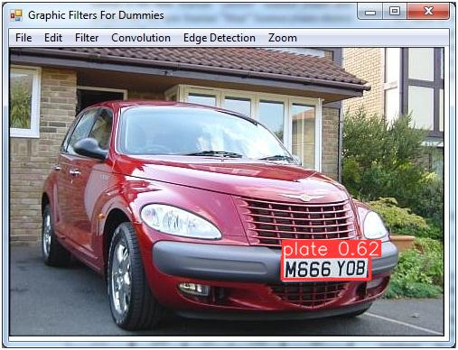
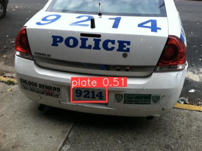
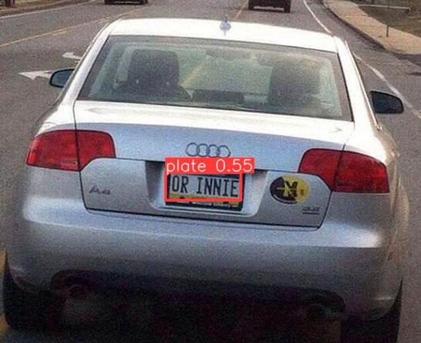
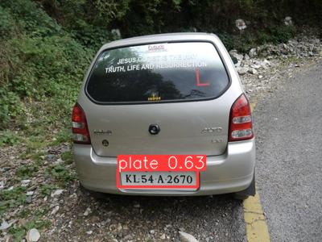
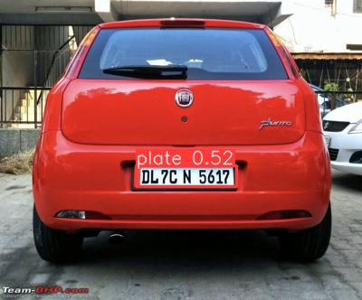
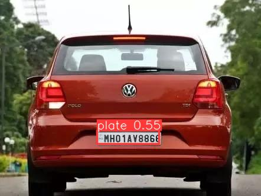

# Streamlit based Automatic Number Plate Recognition 🚘🚙 [](https://www.repostatus.org/#active) [](https://prateekralhan.github.io/)
A streamlit based implementation of Automatic Number Plate Recognition for cars and other vehicles using images or live camera feed.

----------------
#### This work is just an extended implementation of the [great work](https://github.com/mftnakrsu/Automatic_Number_Plate_Recognition_YOLO_OCR) done by [mftnakrsu](https://github.com/mftnakrsu) 
----------------


## Installation:
* Simply run the command **pip install -r requirements.txt** to install the necessary dependencies.

## Usage:
1. Clone this repository and install the dependencies as mentioned above.
2. Make a directory within this cloned repository with the name `.streamlit` *(Don't forget the dot !!)*.
3. Create a file `config.toml` in this directory *(Be aware of the file extension !!)*.
4. Copy-Paste the following contents in this file and save :
```
[theme]
primaryColor="#ffb5b5"
backgroundColor="#132743"
secondaryBackgroundColor="#407088"
textColor="#ffb5b5"
```

5. Navigate to the root directory of this repository and simply run the command: 
```
streamlit run app.py
```
Navigate to http://localhost:8501 in your web-browser.


------------
## Results 
------------

| **Output Images**  | **Output Images**  |
|---------------------|-----------------------|
|   |   |
|   |   |
|   |   |

### Running the Dockerized App
1. Ensure you have Docker Installed and Setup in your OS (Windows/Mac/Linux). For detailed Instructions, please refer [this.](https://docs.docker.com/engine/install/)
2. Navigate to the folder where you have cloned this repository ( where the ***Dockerfile*** is present ).
3. Build the Docker Image (don't forget the dot!! :smile: ): 
```
docker build -f Dockerfile -t app:latest .
```
4. Run the docker:
```
docker run -p 8501:8501 app:latest
```

This will launch the dockerized app. Navigate to ***http://localhost:8501/*** in your browser to have a look at your application. You can check the status of your all available running dockers by:
```
docker ps
```
